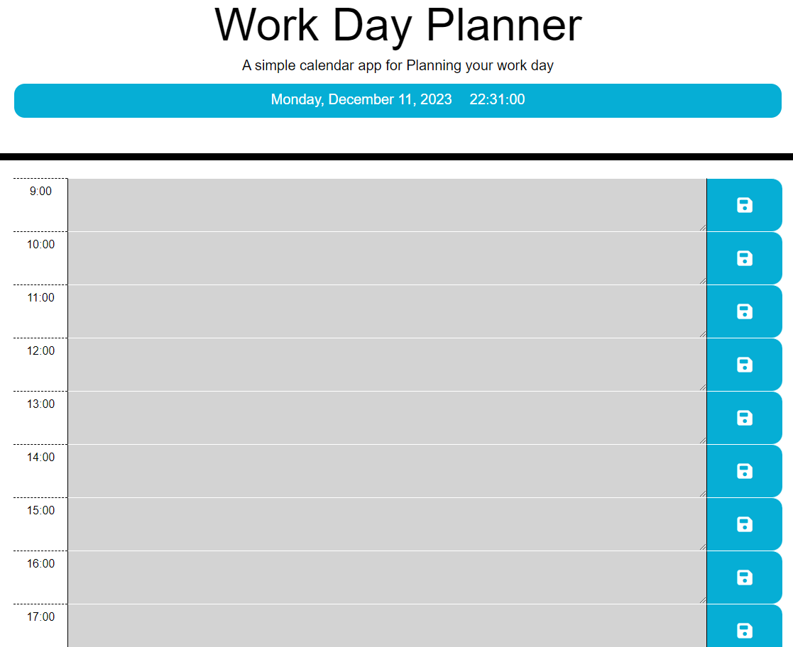

# day-planner
A calendar application that allows a users to make plans for each hour of the work day.

## Purpose of the Project
To help users to effectively plan their work day.

 ## Tools used
 JavaScript, HTML, CSS, Dayjs and JQuery
 

## How to contribute
Views concerning the project are very much welcome and please feel free to 
contribute to this project if the goal is to improve the code base or to add more features to the project itself to make it better and more user friendly.

## Link to the Deployed Project:
https://sam-wisdoms.github.io/day-planner/
  

## GitHub Repository for the Project:
https://github.com/Sam-Wisdoms/day-planner

## Project Screenhot

## Credits: 
Mr. Praktikto Ariestyadi (Instructor)
Mr. Marcin Karcperskie (TA)
Benjamin Semah (Developer)
Kelly Besong (Aspiring Developer)
https://www.w3schools.com/jquery/default.asp
www.jQuery.com
www.day.js.org

